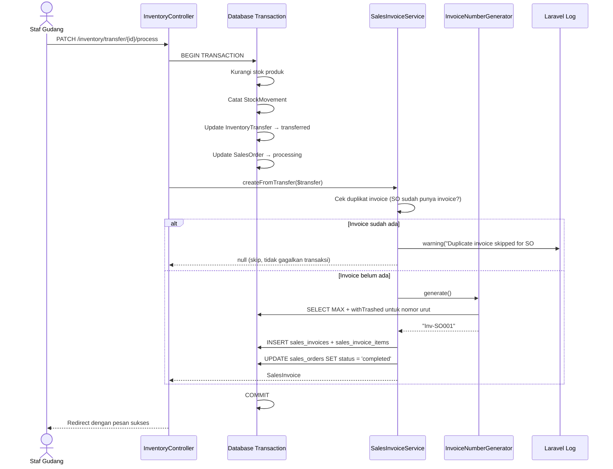
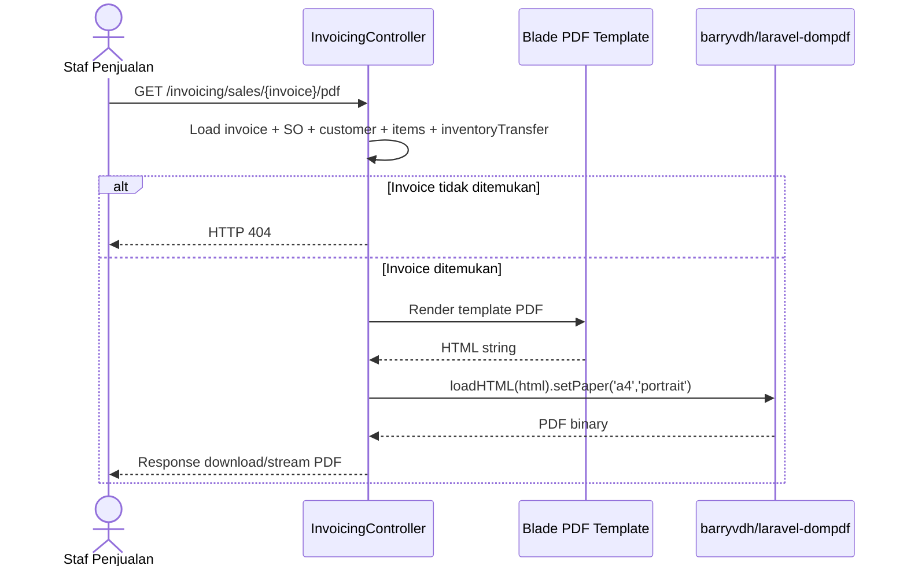

# Dokumen Desain Teknis: Sales Invoice Automation

## Ikhtisar

Fitur ini mengotomatiskan pembuatan Sales Invoice segera setelah Inventory Transfer selesai diproses (status berubah menjadi `transferred`). Sistem akan membuat invoice secara otomatis di dalam transaksi database yang sama dengan proses transfer, menghitung nilai invoice dari data Sales Order, dan menyediakan tampilan detail serta cetak PDF dengan kolom tanda tangan fisik.

Alur bisnis yang didukung:

```
Sales Order → Inventory Transfer (transferred) → Sales Invoice (auto-created) → Customer Payment
```

Komponen utama yang dimodifikasi/ditambahkan:
- `InventoryController::process()` — ditambahkan logika pembuatan invoice otomatis
- `InvoiceNumberGenerator` — service untuk generate nomor invoice unik
- `SalesInvoiceService` — service untuk kalkulasi dan pembuatan invoice
- `InvoicingController` — ditambahkan action cetak PDF
- View: halaman detail invoice (diperbarui) + template PDF

---

## Arsitektur

### Alur Pembuatan Invoice Otomatis



### Alur Cetak PDF



---

## Komponen dan Antarmuka

### 1. `SalesInvoiceService`

**Path:** `app/Services/SalesInvoiceService.php`

```php
class SalesInvoiceService
{
    public function createFromTransfer(InventoryTransfer $transfer): ?SalesInvoice
    // Membuat SalesInvoice dari InventoryTransfer yang sudah transferred.
    // Mengembalikan null jika invoice sudah ada (duplikat).
    // Dipanggil di dalam DB::transaction yang sudah berjalan.
}
```

Tanggung jawab:
- Cek duplikat: `SalesInvoice::where('sales_order_id', $so->id)->exists()`
- Kalkulasi subtotal, tax (11%), total
- Buat record `sales_invoices` dan `sales_invoice_items`
- Update status `sales_orders` → `completed`

### 2. `InvoiceNumberGenerator`

**Path:** `app/Services/InvoiceNumberGenerator.php`

```php
class InvoiceNumberGenerator
{
    public function generate(): string
    // Menghasilkan nomor invoice format "Inv-SO{NNN}" yang unik.
    // Menggunakan withTrashed() agar soft-deleted invoice tetap dihitung.
}
```

Logika penomoran:
```php
$last = SalesInvoice::withTrashed()->latest('id')->first();
$seq  = $last ? ($last->id + 1) : 1;
return 'Inv-SO' . str_pad($seq, 3, '0', STR_PAD_LEFT);
```

> Catatan: Menggunakan `id` auto-increment sebagai basis urutan untuk menghindari race condition pada concurrent request.

### 3. Modifikasi `InventoryController::process()`

Tambahkan pemanggilan `SalesInvoiceService` di dalam `DB::transaction` yang sudah ada:

```php
DB::transaction(function () use ($request, $transfer) {
    // ... kode existing (stok, stock movement, update transfer) ...

    app(SalesInvoiceService::class)->createFromTransfer($transfer);
});
```

### 4. Modifikasi `InvoicingController`

Tambahkan method baru:

```php
public function salesPdf(SalesInvoice $invoice): Response
// Menghasilkan PDF invoice dan mengembalikan sebagai stream/download.
```

### 5. Route Baru

```php
// routes/web.php
Route::get('/invoicing/sales/{invoice}/pdf', [InvoicingController::class, 'salesPdf'])
     ->name('invoicing.sales.pdf');
```

### 6. View: Template PDF

**Path:** `resources/views/invoicing/sales/pdf.blade.php`

Konten:
- Header perusahaan (nama, alamat)
- Nomor Invoice + Nomor SO referensi
- Nama Customer + Tanggal Invoice
- Tabel item (nama produk, QTY, harga satuan, total per item)
- Subtotal, PPN 11%, Total
- Dua kolom tanda tangan:
  - Kiri: "Sales / Pemberi Barang" — nama dari `inventory_transfer.created_by` (user name)
  - Kanan: "Penerima Barang" — nama dari `sales_order.customer.name`

### 7. Modifikasi View: Detail Invoice

**Path:** `resources/views/invoicing/sales/show.blade.php`

Tambahkan:
- Tombol "Cetak PDF" yang mengarah ke route `invoicing.sales.pdf`
- Bagian informasi TTD Sales dan TTD Penerima dari data Inventory Transfer terkait

---

## Model Data

### Tabel yang Sudah Ada (Tidak Berubah Skema)

**`sales_invoices`** — sudah memiliki semua field yang dibutuhkan:

| Field | Tipe | Keterangan |
|---|---|---|
| `id` | bigint PK | |
| `inv_number` | varchar(30) UNIQUE | Format: `Inv-SO001` |
| `sales_order_id` | FK → sales_orders | |
| `customer_id` | FK → customers | |
| `created_by` | FK → users | |
| `invoice_date` | date | Tanggal transfer selesai |
| `due_date` | date | invoice_date + 30 hari |
| `status` | enum | `issued` (default saat auto-create) |
| `payment_status` | enum | `unpaid` (default) |
| `subtotal` | decimal(15,2) | |
| `discount` | decimal(15,2) | Dari SO |
| `tax` | decimal(15,2) | 11% dari subtotal |
| `total` | decimal(15,2) | subtotal + tax - discount |
| `paid_amount` | decimal(15,2) | |
| `notes` | text nullable | |

**`sales_invoice_items`** — sudah memiliki semua field yang dibutuhkan:

| Field | Tipe | Keterangan |
|---|---|---|
| `id` | bigint PK | |
| `sales_invoice_id` | FK → sales_invoices | |
| `product_id` | FK → products | |
| `quantity` | int | Dari SO item |
| `unit_price` | decimal(15,2) | Dari SO item |
| `discount` | decimal(15,2) | Dari SO item |
| `total` | decimal(15,2) | quantity × unit_price - discount |

**`inventory_transfers`** — field yang digunakan untuk data TTD PDF:

| Field | Digunakan Untuk |
|---|---|
| `created_by` | Nama Sales (TTD kiri PDF) — via relasi `creator->name` |
| `receiver_name` | Nama penerima (TTD kanan PDF) — diisi saat proses transfer |
| `giver_confirmed_at` | Timestamp konfirmasi pemberi |
| `receiver_confirmed_at` | Timestamp konfirmasi penerima |

> Catatan konteks: `created_by` di `inventory_transfers` adalah user yang membuat dokumen IT (staf gudang/sales), namanya diambil via relasi `$transfer->creator->name`. Nama Customer untuk TTD Penerima diambil dari `$transfer->salesOrder->customer->name`.

### Relasi Baru yang Dibutuhkan

Tambahkan relasi di `SalesInvoice` model:

```php
public function inventoryTransfer(): HasOneThrough
{
    return $this->hasOneThrough(
        InventoryTransfer::class,
        SalesOrder::class,
        'id',           // FK di sales_orders
        'sales_order_id', // FK di inventory_transfers
        'sales_order_id', // local key di sales_invoices
        'id'            // local key di sales_orders
    );
}
```

### Dependensi Baru

Tambahkan package PDF ke `composer.json`:

```
barryvdh/laravel-dompdf: ^3.0
```

Install: `composer require barryvdh/laravel-dompdf`

---

## Correctness Properties

*A property is a characteristic or behavior that should hold true across all valid executions of a system — essentially, a formal statement about what the system should do. Properties serve as the bridge between human-readable specifications and machine-verifiable correctness guarantees.*


### Property 1: Invoice terbuat tepat satu kali per Inventory Transfer

*Untuk setiap* Inventory Transfer yang statusnya berubah menjadi `transferred`, tepat satu Sales Invoice harus terbuat — tidak lebih, tidak kurang. Jika transfer yang sama diproses ulang (atau dipanggil dua kali), jumlah invoice untuk Sales Order tersebut tetap satu.

**Validates: Requirements 1.1, 1.6**

### Property 2: Format nomor invoice valid dan unik

*Untuk setiap* Sales Invoice yang dibuat oleh sistem, `inv_number` harus cocok dengan pola `^Inv-SO\d{3}$` dan tidak ada dua invoice yang memiliki `inv_number` yang sama, termasuk setelah ada invoice yang di-soft-delete.

**Validates: Requirements 1.2, 6.1, 6.2, 6.3**

### Property 3: Data invoice sesuai dengan Sales Order dan Transfer terkait

*Untuk setiap* Sales Order dengan item-item tertentu, invoice yang dibuat harus memiliki `customer_id` dan `sales_order_id` yang sama dengan SO, setiap item invoice harus memiliki `product_id`, `quantity`, dan `unit_price` yang identik dengan item SO, dan `invoice_date` harus sama dengan tanggal transfer selesai diproses.

**Validates: Requirements 1.3, 1.4**

### Property 4: Status awal invoice selalu issued dan unpaid

*Untuk setiap* Sales Invoice yang baru dibuat secara otomatis, `status` harus bernilai `issued` dan `payment_status` harus bernilai `unpaid`.

**Validates: Requirements 1.5**

### Property 5: Kalkulasi nilai invoice selalu benar

*Untuk setiap* Sales Order dengan item-item yang memiliki `quantity` dan `unit_price` sembarang, invoice yang dibuat harus memenuhi: `subtotal = Σ(quantity × unit_price)`, `tax = subtotal × 0.11`, dan `total = subtotal + tax - discount` di mana `discount` diambil dari SO.

**Validates: Requirements 2.1, 2.2, 2.3, 2.4**

### Property 6: Status Sales Order berubah menjadi completed setelah invoice dibuat

*Untuk setiap* Sales Order yang invoice-nya berhasil dibuat secara otomatis, status SO harus berubah menjadi `completed`.

**Validates: Requirements 5.4**

### Property 7: Atomicity — kegagalan invoice me-rollback seluruh transaksi

*Untuk setiap* proses Inventory Transfer yang gagal membuat invoice di tengah jalan (simulasi exception), tidak boleh ada perubahan parsial yang tersimpan: stok tidak berkurang, status transfer tidak berubah, dan tidak ada invoice yang terbuat.

**Validates: Requirements 5.1, 5.2**

### Property 8: Indikator warna status pembayaran selalu konsisten

*Untuk setiap* Sales Invoice dengan `payment_status` sembarang (`unpaid`, `partial`, `paid`), tampilan badge di halaman daftar dan detail harus menggunakan class Bootstrap yang sesuai: `bg-danger` untuk `unpaid`, `bg-warning` untuk `partial`, dan `bg-success` untuk `paid`.

**Validates: Requirements 3.3, 3.4, 3.5**

### Property 9: Halaman detail invoice memuat semua informasi yang diperlukan

*Untuk setiap* Sales Invoice, response HTML halaman detail harus mengandung: nomor invoice, nomor SO referensi, nama customer, tanggal invoice, nama setiap produk dalam item, subtotal, PPN, total, status pembayaran, nama TTD Sales, dan nama TTD Penerima.

**Validates: Requirements 3.1, 3.6**

### Property 10: Template PDF memuat semua konten yang diperlukan

*Untuk setiap* Sales Invoice, HTML yang dirender oleh template PDF harus mengandung: nama perusahaan "PT. Baktiya Utama Indonesia", nomor invoice, nomor SO, nama customer, tanggal invoice, setiap item transaksi, subtotal, PPN, total, label "Sales / Pemberi Barang" beserta nama Sales, dan label "Penerima Barang" beserta nama Customer.

**Validates: Requirements 4.1, 4.2, 4.3, 4.4**

---

## Penanganan Error

### Kegagalan Pembuatan Invoice (dalam Transaction)

Jika `SalesInvoiceService::createFromTransfer()` melempar exception:
- `DB::transaction()` secara otomatis melakukan rollback semua perubahan
- Exception di-catch di `InventoryController::process()` dan di-log
- User mendapat pesan error yang informatif via session flash
- Status Inventory Transfer tetap `pending`

### Invoice Duplikat

Jika `SalesInvoice::where('sales_order_id', $so->id)->exists()` bernilai true:
- Service mengembalikan `null` tanpa melempar exception
- Log warning dicatat: `"Duplicate invoice skipped for SO #{so_id}"`
- Proses Inventory Transfer tetap berjalan normal
- Tidak ada perubahan pada invoice yang sudah ada

### PDF Invoice Tidak Ditemukan

Jika `SalesInvoice` dengan ID yang diminta tidak ada:
- Laravel Route Model Binding secara otomatis mengembalikan HTTP 404
- Tidak perlu penanganan manual tambahan

### Race Condition pada Penomoran Invoice

Untuk mencegah dua invoice mendapat nomor yang sama pada concurrent request:
- Gunakan `DB::select('SELECT MAX(id) FROM sales_invoices')` di dalam transaction yang sama
- Atau gunakan database-level UNIQUE constraint sebagai safety net terakhir
- Jika terjadi duplicate key violation, exception akan di-catch dan di-log

---

## Strategi Pengujian

### Pendekatan Dual Testing

Pengujian menggunakan dua pendekatan yang saling melengkapi:
- **Unit/Feature tests**: Memverifikasi contoh spesifik, edge case, dan kondisi error
- **Property-based tests**: Memverifikasi properti universal di berbagai input yang di-generate secara acak

### Library Property-Based Testing

Gunakan **[eris/eris](https://github.com/giorgiosironi/eris)** — library property-based testing untuk PHP yang kompatibel dengan PHPUnit.

Install: `composer require --dev giorgiosironi/eris`

Setiap property test dikonfigurasi dengan minimum **100 iterasi**.

### Unit / Feature Tests (PHPUnit)

Fokus pada contoh spesifik dan edge case:

- **`InvoiceNumberGeneratorTest`**: Verifikasi format `Inv-SO001`, `Inv-SO002`, dst.
- **`SalesInvoiceServiceTest`**: Verifikasi skip duplikat + log warning
- **`InvoicingControllerTest`**: HTTP 404 saat invoice tidak ditemukan (PDF route)
- **`InventoryControllerTest`**: Rollback saat invoice gagal dibuat (simulasi exception)
- **`SalesInvoiceUniqueConstraintTest`**: Verifikasi UNIQUE constraint di level database

### Property-Based Tests (Eris)

Setiap property dari dokumen desain diimplementasikan sebagai satu property test:

```
// Feature: sales-invoice-automation, Property 1: Invoice terbuat tepat satu kali per IT
// Feature: sales-invoice-automation, Property 2: Format nomor invoice valid dan unik
// Feature: sales-invoice-automation, Property 3: Data invoice sesuai SO dan Transfer
// Feature: sales-invoice-automation, Property 4: Status awal invoice issued dan unpaid
// Feature: sales-invoice-automation, Property 5: Kalkulasi nilai invoice selalu benar
// Feature: sales-invoice-automation, Property 6: SO status completed setelah invoice dibuat
// Feature: sales-invoice-automation, Property 7: Atomicity rollback saat kegagalan
// Feature: sales-invoice-automation, Property 8: Indikator warna status pembayaran konsisten
// Feature: sales-invoice-automation, Property 9: Halaman detail memuat semua informasi
// Feature: sales-invoice-automation, Property 10: Template PDF memuat semua konten
```

Contoh struktur property test dengan Eris:

```php
use Eris\TestTrait;
use Eris\Generator;

class SalesInvoiceCalculationPropertyTest extends TestCase
{
    use TestTrait;

    /** @test */
    public function tax_is_always_eleven_percent_of_subtotal(): void
    {
        // Feature: sales-invoice-automation, Property 5: Kalkulasi nilai invoice selalu benar
        $this->forAll(
            Generator\pos(),  // random positive subtotal
            Generator\pos()   // random positive discount
        )
        ->withMaxSize(10000)
        ->times(100)
        ->then(function (int $subtotalCents, int $discountCents) {
            $subtotal = $subtotalCents / 100;
            $discount = min($discountCents / 100, $subtotal);
            $tax      = round($subtotal * 0.11, 2);
            $total    = round($subtotal + $tax - $discount, 2);

            $invoice = $this->createInvoiceWithValues($subtotal, $discount);

            $this->assertEquals($tax, $invoice->tax);
            $this->assertEquals($total, $invoice->total);
        });
    }
}
```

### Keseimbangan Unit vs Property Tests

- Unit tests menangkap bug konkret pada contoh spesifik dan edge case
- Property tests memverifikasi kebenaran umum di ribuan kombinasi input
- Hindari menulis terlalu banyak unit test untuk kasus yang sudah dicakup property test
- Unit tests difokuskan pada: integrasi antar komponen, error conditions, dan konfigurasi teknis (ukuran kertas PDF, HTTP status code)
